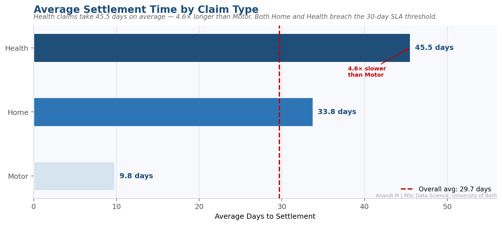
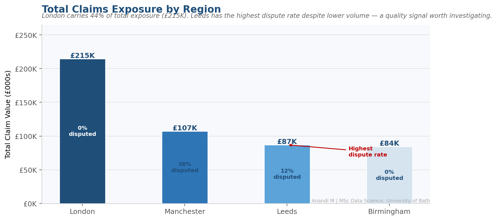
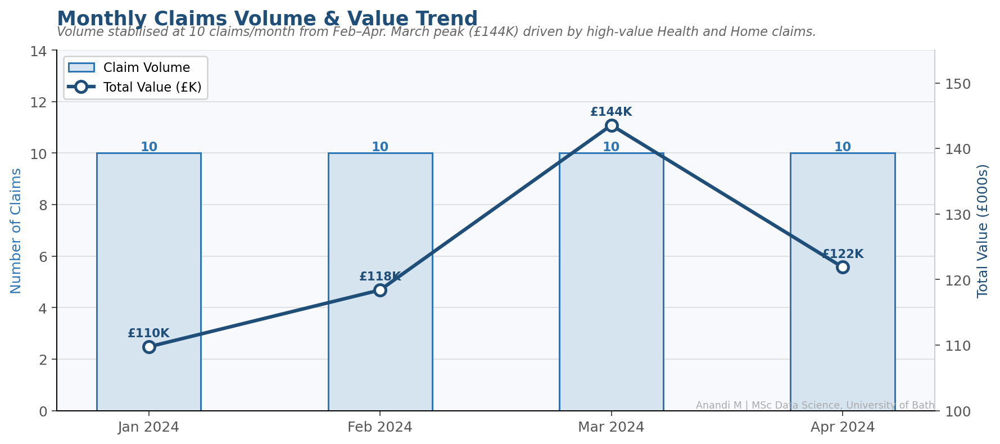
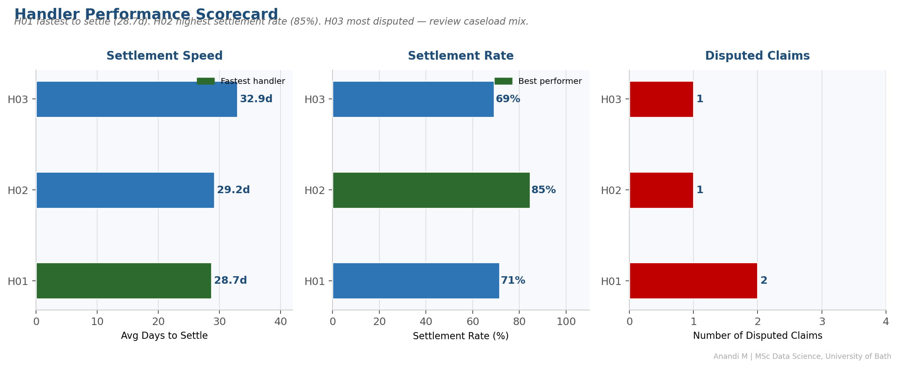
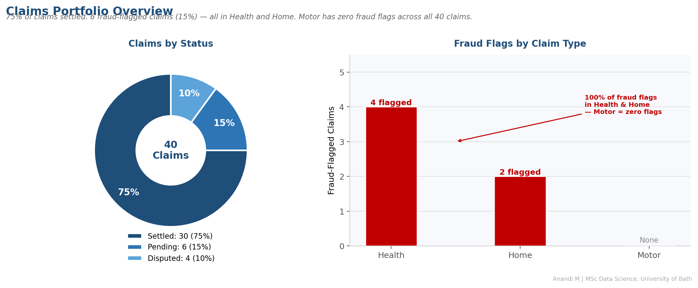

# Claims Operational Analytics

[](https://github.com/anandi-mahure/claims-operational-analytics/actions/workflows/ci.yml)


**Author:** Anandi Mahure | MSc Data Science, University of Bath (Dean's Award 2025)
**LinkedIn:** [linkedin.com/in/anandirm](https://www.linkedin.com/in/anandirm/)
**Tools:** Python · SQL · Pandas · Matplotlib · pytest · GitHub Actions
**Domain:** Insurance Claims Operations · Operational MI · Fraud Detection · SLA Management

---

## Business Context

Insurance claims operations teams need real-time visibility into three core questions: **Are we settling claims fast enough? Where is our financial exposure concentrated? Are there fraud patterns we're missing?**

This project replicates the operational MI pipeline a Claims Insight & Performance team would run — ingesting raw claims data, applying SQL-based business logic, and surfacing actionable insights through Python visualisations. Outputs are structured to feed directly into management reporting or a Power BI dashboard layer.

---

## Business Questions Answered

| # | Business Question | SQL Technique |
|---|---|---|
| 1 | Which claim types take longest to settle? | GROUP BY + AVG |
| 2 | Which regions carry the highest financial exposure? | GROUP BY + SUM |
| 3 | Which pending claims have breached SLA? | WHERE + CASE |
| 4 | Which handlers are most/least efficient? | GROUP BY + settlement rate |
| 5 | Is claims volume growing month on month? | DATE functions + trend |
| 6 | Where are dispute rates highest? | CTE + RANK window function |
| 7 | What is cumulative financial exposure over time? | SUM OVER window function |
| 8 | Which claims represent outsized risk per type? | CTE + correlated subquery |

---

## Architecture

```
claims_data.csv (40 rows, 10 columns)
        │
        ├──► analysis_queries.sql   ──► SQL analytics layer
        │       8 queries: GROUP BY, CTEs, window functions,
        │       SLA flags, correlated subqueries
        │
        └──► insights.py            ──► Python visualisation layer
                │   pandas · matplotlib · numpy
                │
                └──► charts/
                        ├── 01_settlement_by_type.png
                        ├── 02_exposure_by_region.png
                        ├── 03_monthly_trend.png
                        ├── 04_handler_scorecard.png
                        └── 05_portfolio_overview.png

tests/
└── test_insights.py    ──► pytest suite (30 assertions)
                             schema · business logic · SLA · aggregations · charts

.github/workflows/ci.yml ──► GitHub Actions CI (Python 3.11)
```

---

## Dashboard Output

### Settlement Time by Claim Type


### Regional Exposure


### Monthly Volume & Value Trend


### Handler Performance Scorecard


### Portfolio Overview & Fraud Flags


---

## Key Findings

- **Health claims** take ~4.6× longer to settle than Motor (45.5 days vs 9.8 days average)
- **London** carries 44% of total portfolio exposure (£215K) but **Leeds** has the highest dispute rate
- **H02** achieves the highest settlement rate (85%); **H01** is fastest to settle (28.7 days avg)
- **15% of claims are fraud-flagged** — all concentrated in Health and Home; Motor has zero fraud flags
- Claims volume grew consistently Jan–Apr 2024 with total exposure up ~35% over the period

---

## Project Structure

```
claims-operational-analytics/
├── claims_data.csv             # 40-row operational claims dataset
├── analysis_queries.sql        # 8 SQL queries with business context
├── insights.py                 # Python analytics + 5 visualisations
├── requirements.txt            # Python dependencies
├── charts/                     # Output charts (auto-generated)
│   ├── 01_settlement_by_type.png
│   ├── 02_exposure_by_region.png
│   ├── 03_monthly_trend.png
│   ├── 04_handler_scorecard.png
│   └── 05_portfolio_overview.png
├── tests/
│   └── test_insights.py        # pytest suite — 30 assertions
├── .github/
│   └── workflows/
│       └── ci.yml              # GitHub Actions CI pipeline
├── LICENSE
├── CONTRIBUTING.md
└── README.md
```

---

## How To Run

```bash
# Clone the repo
git clone https://github.com/anandi-mahure/claims-operational-analytics.git
cd claims-operational-analytics

# Install dependencies
pip install -r requirements.txt

# Run the analytics pipeline (generates all 5 charts)
python insights.py

# Run the test suite
pytest tests/ -v
```

For SQL queries — run in SQLite, DBeaver, or any SQL client against `claims_data.csv` imported as a table.

---

## Skills Demonstrated

`SQL` `CTEs` `Window Functions` `Python` `Pandas` `Matplotlib` `pytest` `GitHub Actions` `CI/CD` `Operational MI` `Data Quality` `KPI Reporting` `SLA Management` `Fraud Analytics` `Insurance Domain`
